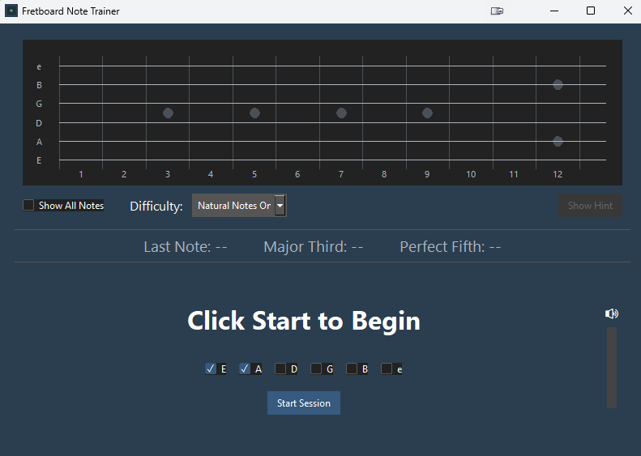

# FretFlow

An interactive application to help guitarists learn and practice note positions on the fretboard. The app uses real-time audio detection to provide immediate feedback as you play notes on your guitar.



## Features

- Real-time audio detection and note recognition
- Visual fretboard diagram with note positions
- Shows relationships between notes (major thirds and perfect fifths)
- Two difficulty modes: Natural Notes Only and All Notes
- Customizable string selection for focused practice
- Visual volume indicator
- Dark theme for reduced eye strain
- Show/hide all note positions for reference
- Hint system for learning

## Requirements

- Python 3.8 or higher
- A working microphone/audio input device
- The following Python packages:
  - tkinter (usually included with Python)
  - ttkbootstrap >= 1.10.0
  - numpy >= 1.21.0
  - sounddevice >= 0.4.5
  - librosa >= 0.9.0

## Installation

1. Clone this repository:
```bash
git clone https://github.com/walked/fretflow.git
cd fretflow
```

2. Install the required packages:
```bash
pip install -r requirements.txt
```

3. Run the application:
```bash
python fretflow.py
```

## System Compatibility

- **Windows**: Fully tested and supported
- **MacOS**: Not tested, but should work with proper Python environment setup
- **Linux**: Not tested, but should work with proper Python environment setup

## Audio Device Configuration

The application uses your system's default audio input device. To change the input device:

1. **Windows**: 
   - Right-click the speaker icon in the system tray
   - Select "Sound settings"
   - Choose your desired input device under "Input"

2. **MacOS/Linux**:
   - Configure your default input device through system sound settings
   - Alternatively, you can modify the code to use a specific device by setting `sounddevice.default.device`

## Usage

1. Launch the application
2. Select which strings you want to practice (default: Low E and A strings)
3. Choose difficulty level:
   - "Natural Notes Only" for basic practice (A, B, C, D, E, F, G)
   - "All Notes" to include sharps/flats
4. Click "Start Session"
5. Play the requested note on your guitar
6. The app will provide immediate feedback:
   - Green circle: Correct note
   - Red X: Wrong note
   - Blue circle: Major third relationship
   - Yellow circle: Perfect fifth relationship

## Tips for Best Results

1. Ensure your guitar is in tune (standard tuning: E A D G B E)
2. Use a clean guitar tone (minimal effects)
3. Play notes clearly and allow them to ring
4. Adjust your playing volume based on the volume indicator
5. Use the "Show All Notes" feature to learn note positions
6. Use the hint button if you're stuck

## Troubleshooting

1. **No audio detection**:
   - Check if your microphone is properly connected
   - Verify it's selected as the default input device
   - Check system permissions for microphone access

2. **Poor note recognition**:
   - Ensure your guitar is in tune
   - Play notes clearly and with consistent volume
   - Reduce background noise
   - Try adjusting your distance from the microphone

3. **Application not starting**:
   - Verify all required packages are installed
   - Check Python version compatibility
   - Look for error messages in the console

## Contributing

Contributions are welcome! Please feel free to submit a Pull Request.

## License

MIT License

Copyright (c) 2024 Francis Setash

Permission is hereby granted, free of charge, to any person obtaining a copy
of this software and associated documentation files (the "Software"), to deal
in the Software without restriction, including without limitation the rights
to use, copy, modify, merge, publish, distribute, sublicense, and/or sell
copies of the Software, and to permit persons to whom the Software is
furnished to do so, subject to the following conditions:

The above copyright notice and this permission notice shall be included in all
copies or substantial portions of the Software.

THE SOFTWARE IS PROVIDED "AS IS", WITHOUT WARRANTY OF ANY KIND, EXPRESS OR
IMPLIED, INCLUDING BUT NOT LIMITED TO THE WARRANTIES OF MERCHANTABILITY,
FITNESS FOR A PARTICULAR PURPOSE AND NONINFRINGEMENT. IN NO EVENT SHALL THE
AUTHORS OR COPYRIGHT HOLDERS BE LIABLE FOR ANY CLAIM, DAMAGES OR OTHER
LIABILITY, WHETHER IN AN ACTION OF CONTRACT, TORT OR OTHERWISE, ARISING FROM,
OUT OF OR IN CONNECTION WITH THE SOFTWARE OR THE USE OR OTHER DEALINGS IN THE
SOFTWARE.

## Acknowledgments

- Built with ttkbootstrap for modern UI styling
- Uses librosa for audio processing
- Inspired by the need for interactive fretboard learning tools 
